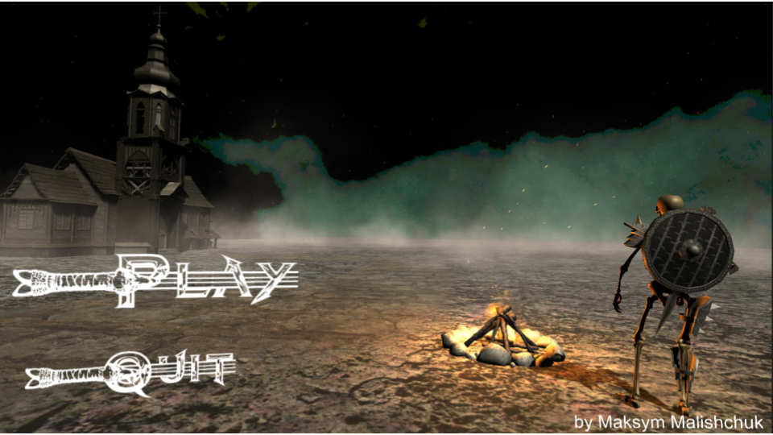
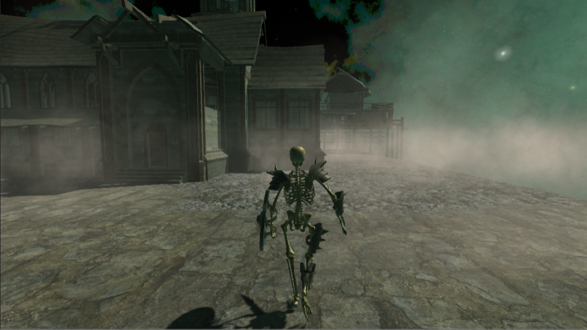
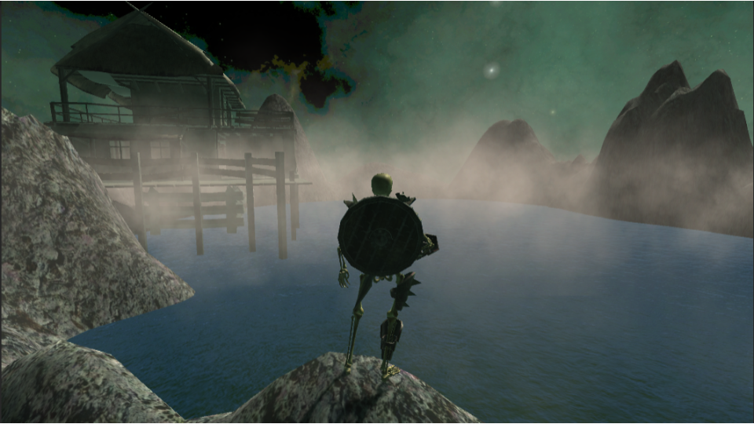
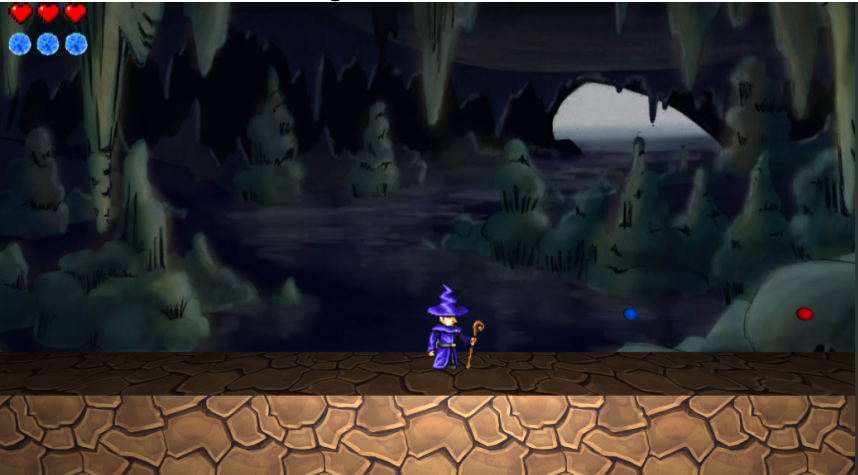
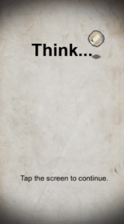
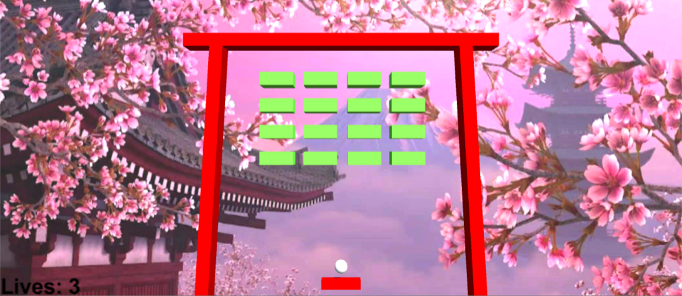
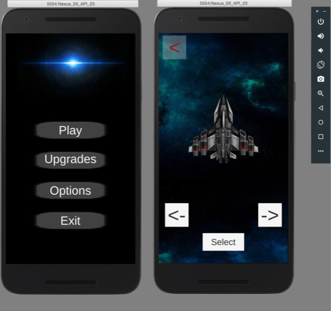
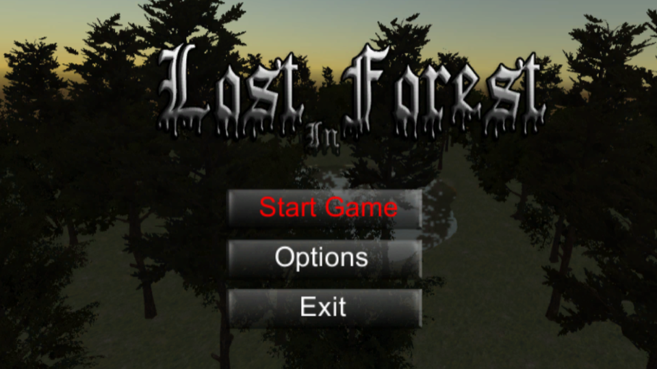
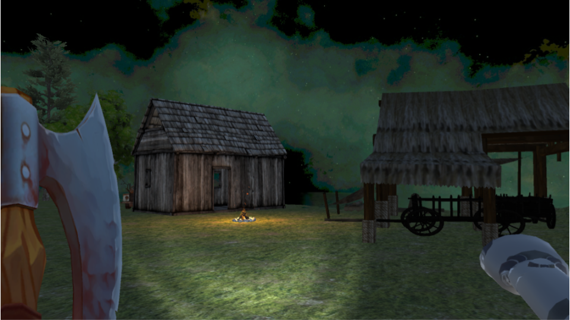

# Some of my C# scripts created in Unity 3D

***

## - 3D RPG Game
#### YouTube link to the demo: [You Tube](https://www.youtube.com/watch?v=-KUusaS505M&list=PLAjDetgWAMwMN3NOLCWJz-fGVJ3QjS9-7&index=2)

***

## - 3D Platformer 
#### YouTube link to the demo: [You Tube](https://www.youtube.com/watch?v=459aBjawbaM&index=1&list=PLAjDetgWAMwMN3NOLCWJz-fGVJ3QjS9-7)

***

## - Heads or Tails (Android Game)

***

## - Breaking Bricks (Android Game)

***

## - Space Shooted (Android Game)

***

## - Mario Clone 

***

## - Lost in Forest 

***
